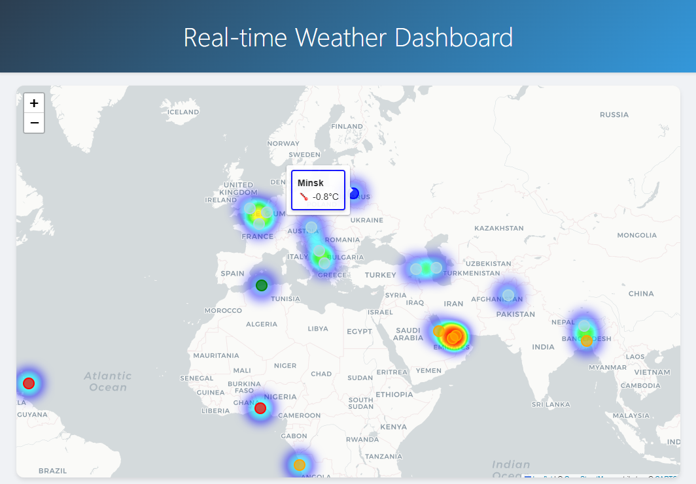
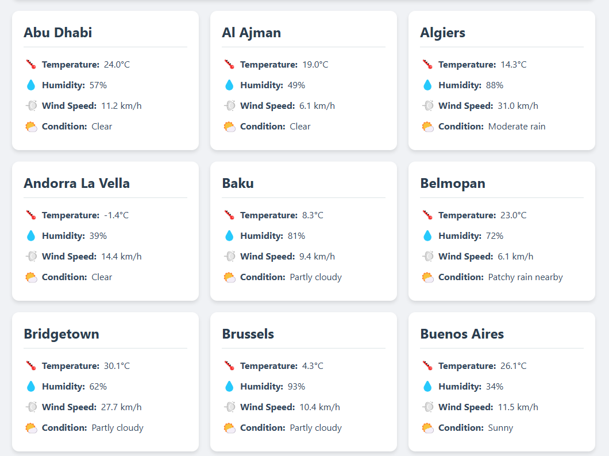

# Real-time World Capitals Weather Dashboard

A real-time weather monitoring dashboard that displays weather information for world capitals and all UAE emirates. The dashboard features an interactive map and detailed weather cards.

## Features

- Interactive world map with temperature-based color coding
- Real-time weather updates for world capitals and UAE emirates
- Temperature heat map overlay
- Detailed weather cards with temperature, humidity, wind speed, and conditions
- Search functionality to filter cities
- Responsive design for all screen sizes
- Color-coded temperature indicators
- Hover tooltips on map markers

## Screenshots

### Interactive Map View

*Interactive map showing world capitals with temperature-based coloring and heat map overlay*

### Weather Cards View

*Detailed weather cards showing current conditions for each city*

## Data Display

For each city, the dashboard shows:
- Temperature (°C)
- Humidity (%)
- Wind Speed (km/h)
- Weather Condition
- Color-coded temperature indicators

## Technical Details

The project consists of three main components:
1. **Producer**: Fetches weather data from WeatherAPI.com
2. **Consumer**: Processes and stores the data in SQLite database
3. **Dashboard**: Flask web application displaying the data

## Setup

1. Clone the repository
2. Install requirements:
```bash
pip install -r
```