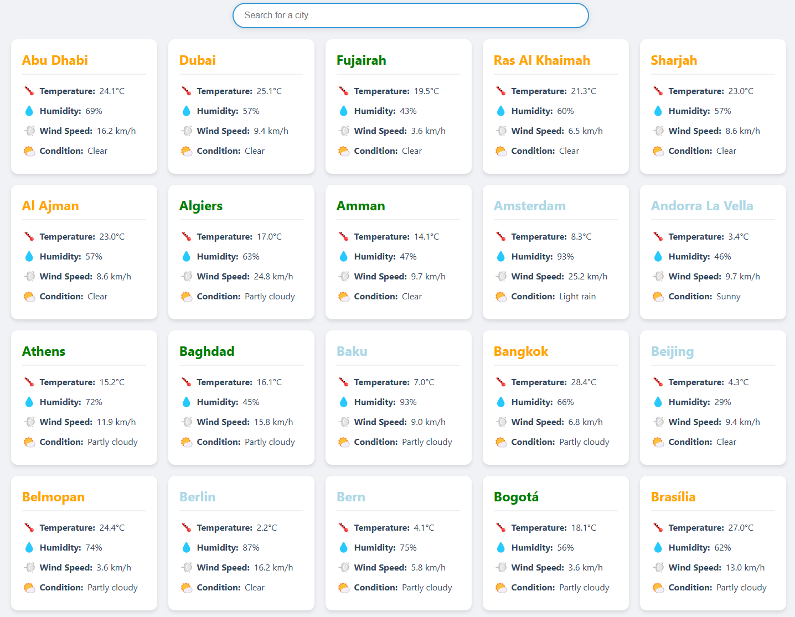

# Real-time World Capitals Weather Dashboard

A real-time weather monitoring dashboard that displays weather information for world capitals and all UAE emirates. The dashboard features an interactive map and detailed weather cards.

## Features

- Interactive world map with temperature-based color coding
- Real-time weather updates for world capitals and UAE emirates
- Temperature heat map overlay
- Detailed weather cards with temperature, humidity, wind speed, and conditions
- Search functionality to filter cities
- Responsive design for all screen sizes
- Color-coded temperature indicators
- Hover tooltips on map markers

## Screenshots

### Interactive Map View

*Interactive map showing world capitals with temperature-based coloring and heat map overlay*

### Weather Cards View

*Detailed weather cards showing current conditions for each city*

## Data Display

For each city, the dashboard shows:
- Temperature (°C)
- Humidity (%)
- Wind Speed (km/h)
- Weather Condition
- Color-coded temperature indicators

## Technical Details

The project consists of three main components:
1. **Producer**: Fetches weather data from WeatherAPI.com
2. **Consumer**: Processes and stores the data in SQLite database
3. **Dashboard**: Flask web application displaying the data

## Setup Instructions

### Prerequisites
- Python 3.8 or higher
- Git
- Internet connection
- WeatherAPI.com API key
- Confluent Kafka account and credentials

### Step 1: Clone the Repository
```bash
git clone <repository-url>
cd <repository-name>
```

### Step 2: Create and Configure Environment Variables
1. Create a `.env` file in the project root:
```bash
touch .env
```

2. Add your credentials to the `.env` file:
```
WEATHERAPI_KEY=your_weatherapi_key
KAFKA_BOOTSTRAP_SERVERS=your_kafka_bootstrap_servers
KAFKA_USERNAME=your_kafka_username
KAFKA_PASSWORD=your_kafka_password
```

### Step 3: Set Up Virtual Environment and Install Dependencies
The project includes a setup script that will:
- Create a virtual environment
- Install all required dependencies
- Set up logging directories

Run the setup script:
```bash
python run_all.py
```

### Step 4: Verify Installation
After running the setup script, you should see:
1. A `venv` directory created
2. A `logs` directory created
3. All dependencies installed
4. Three processes started:
   - Producer (fetching weather data)
   - Consumer (storing data in SQLite)
   - Flask server (web dashboard)

### Step 5: Access the Dashboard
1. Open your web browser
2. Navigate to: `http://localhost:5000`
3. You should see the weather dashboard loading with data

### Troubleshooting
If you encounter issues:
1. Check the log files in the `logs` directory:
   - `logs/producer.log`
   - `logs/consumer.log`
   - `logs/flask.log`
2. Ensure all environment variables are set correctly
3. Verify your internet connection
4. Check your API key and Kafka credentials

### Stopping the Application
To stop all components:
1. Press `Ctrl+C` in the terminal where `run_all.py` is running
2. The script will automatically terminate all processes

## Data Update Frequency
- Weather data is fetched every 6 hours
- UAE cities are prioritized and loaded first
- The dashboard updates automatically as new data arrives

## Notes
- The map shows temperature variations using both markers and a heat map
- Cities are color-coded based on temperature ranges:
  - Blue: < 0°C
  - Light Blue: 0-10°C
  - Green: 10-20°C
  - Orange: 20-30°C
  - Red: > 30°C

## Dependencies
All dependencies are automatically installed by the setup script, but for reference they include:
- Flask
- Folium
- Pandas
- Confluent-Kafka
- Requests
- Python-dotenv