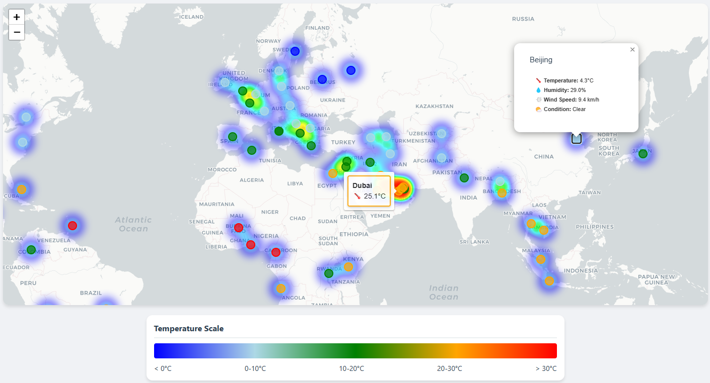

# Global Weather Dashboard with Kafka Streaming

A real-time weather monitoring system that collects data from world capitals using Kafka streaming pipeline and visualizes it on an interactive map.

## Dashboard Preview

### Interactive World Map

*Interactive map showing real-time temperatures with heat map overlay and hover tooltips*

### Weather Cards

*Detailed weather cards showing current conditions for each capital city*

## Features

- 🌍 Real-time weather data from 70+ world capitals
- 🗺️ Interactive map visualization with:
  - Temperature-based heat map
  - Hover tooltips with quick temperature view
  - Detailed popups with full weather information
- 📊 Responsive weather cards with:
  - Current temperature
  - Humidity levels
  - Wind speed
  - Weather conditions
- 🔄 Updates every 6 hours
- 🎨 Temperature-based color coding:
  - Blue: < 0°C
  - Light Blue: 0-10°C
  - Green: 10-20°C
  - Orange: 20-30°C
  - Red: > 30°C
- 💾 Historical data storage in SQLite

## Architecture

- **Producer**: Fetches weather data from WeatherAPI.com every 6 hours
- **Kafka**: Handles data streaming between components
- **Consumer**: Processes incoming data and stores in SQLite
- **Flask App**: Serves the web dashboard with Folium maps
- **Database**: SQLite storing historical weather data

## Prerequisites

- Python 3.8+
- Confluent Kafka account
- WeatherAPI.com API key
- Required Python packages:
  ```bash
  pip install confluent-kafka requests flask folium pandas python-dotenv
  ```

## Environment Setup

Create a `.env` file with your credentials:
```env
WEATHERAPI_KEY=your_weather_api_key
KAFKA_BOOTSTRAP_SERVERS=your_kafka_server
KAFKA_USERNAME=your_kafka_username
KAFKA_PASSWORD=your_kafka_password
```

## Running the Application

1. Start all components using:
```bash
python run_all.py
```

2. Access the dashboard at:
```
http://localhost:5000
```

## Project Structure
```
├── app.py              # Flask application & map visualization
├── producer.py         # Weather data fetcher & Kafka producer
├── consumer.py         # Kafka consumer & database handler
├── run_all.py         # Application orchestrator
├── templates/         
│   └── index.html     # Dashboard template
├── .env               # Environment variables
└── weather_data.db    # SQLite database
```

## Monitoring

Check application logs in the `logs` directory:
- `producer.log`: Weather API and Kafka production logs
- `consumer.log`: Data consumption and storage logs
- `flask.log`: Web server and visualization logs

## License

This project is licensed under the MIT License - see the LICENSE file for details.

## Acknowledgments

- Weather data provided by [WeatherAPI.com](https://www.weatherapi.com/)
- Map visualization using [Folium](https://python-visualization.github.io/folium/)
- Streaming platform by [Confluent Kafka](https://www.confluent.io/)